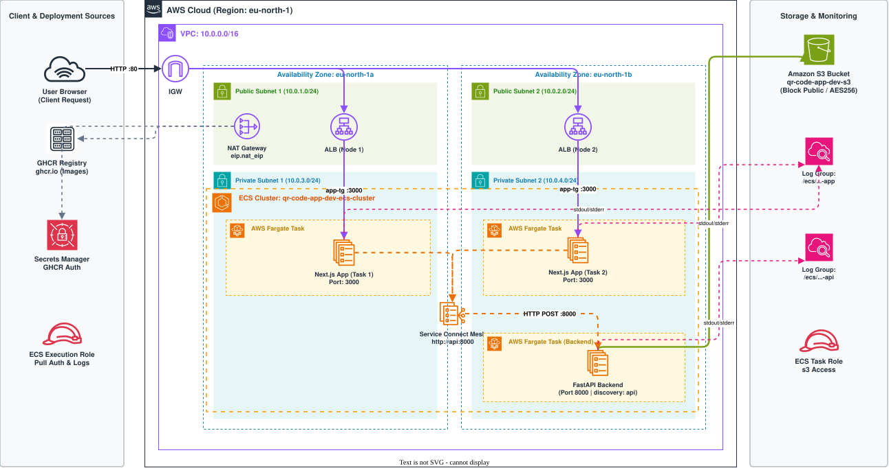

# QR Code App - Comprehensive AWS Infrastructure & Traffic Flow Analysis

This document provides a detailed breakdown of the complete AWS infrastructure, security parameters, microservice configurations, and end-to-end traffic flows for the **QR Code Generator Application**.

---



## 1. Network Infrastructure & Topology (`modules/networking`)

### VPC Setup
- **CIDR Block:** `10.0.0.0/16` with `enable_dns_support = true` and `enable_dns_hostnames = true`.
- **Availability Zones:** Distributed across 2 Availability Zones (`eu-north-1a` and `eu-north-1b`).

### Subnet Layout
- **Public Subnets (2):**
  - `Public Subnet 1`: `10.0.1.0/24` (AZ `eu-north-1a`)
  - `Public Subnet 2`: `10.0.2.0/24` (AZ `eu-north-1b`)
  - `map_public_ip_on_launch = true`
  - Houses the Internet Gateway, Application Load Balancer, and NAT Gateway.
- **Private Subnets (2):**
  - `Private Subnet 1`: `10.0.3.0/24` (AZ `eu-north-1a`)
  - `Private Subnet 2`: `10.0.4.0/24` (AZ `eu-north-1b`)
  - Isolated from direct public internet access. Houses all ECS Fargate tasks.

### Internet & Egress Gateways
- **Internet Gateway (IGW):** Attached to the VPC boundary to allow inbound public HTTP/HTTPS traffic.
- **Single NAT Gateway & Elastic IP (EIP):**
  - **1 NAT Gateway** deployed in `Public Subnet 1` (`10.0.1.0/24`) attached to an Elastic IP (`aws_eip.nat_eip`).
  - Routes all outbound internet traffic from private subnets (image pulls from GHCR, CloudWatch log streaming, Secrets Manager calls).

### Routing Tables
- **Public Route Table:** Routes `0.0.0.0/0` -> Internet Gateway (associated with both public subnets).
- **Private Route Table:** Routes `0.0.0.0/0` -> Single NAT Gateway (associated with both private subnets).

---

## 2. Load Balancing & Traffic Ingress (`modules/alb`)

- **Application Load Balancer (ALB):** Public-facing ALB deployed across both public subnets.
- **ALB Security Group (`alb-sg`):**
  - Ingress: Allows HTTP (`port 80`) and HTTPS (`port 443`) from anywhere (`0.0.0.0/0`).
  - Egress: Allows all outbound traffic (`0.0.0.0/0`).
- **Target Group (`app-tg`):**
  - IP-based target group (`target_type = "ip"`) targeting port `3000` (HTTP).
  - Health check path: `/health` on HTTP port 3000 (30s interval, 5s timeout, 3 healthy threshold).
- **Listeners & Rules:**
  - `http-listener` on port `80` with default forward action to `app-tg`.
  - `app-http-rule` matching path pattern `/*` forwarding to `app-tg`.

---

## 3. Container Compute & Private Service Mesh (`modules/ecs`)

- **ECS Cluster:** `qr-code-app-dev-ecs-cluster` running on AWS Fargate.
- **Service Connect Namespace:** `qr-code-app-dev-service-connect-namespace` (AWS Cloud Map HTTP namespace) for private inter-service communication.
- **ECS Security Group (`ecs_tasks_security_group`):**
  - Ingress port `3000`: Allowed **strictly from `alb-sg`**.
  - Ingress port `8000`: Allowed **internally between tasks** (`self = true` for Service Connect).
  - Egress: All outbound allowed (`0.0.0.0/0`).

### ECS Services & Tasks

#### A. Frontend App Service (`app-service`)
- **Container:** Next.js application (`app_container_image`).
- **Port:** `3000`
- **CPU / Memory:** `512` CPU / `1024` MB Memory.
- **Replicas:** Desired count = `2` tasks across private subnets.
- **ALB Attachment:** Connected to `app-tg` Target Group.
- **Service Connect:** Enabled.
- **Environment Variable:** `INTERNAL_API_URL = http://api.qr-code-app-dev-service-connect-namespace:8000`
- **Logging:** CloudWatch Log Group `/ecs/qr-code-app-dev-app`.

#### B. Backend API Service (`api-service`)
- **Container:** Python FastAPI application (`api_container_image`).
- **Port:** `8000`
- **CPU / Memory:** `512` CPU / `1024` MB Memory.
- **Replicas:** Desired count = `1` task in private subnets.
- **ALB Attachment:** **NONE** (Completely private service).
- **Service Connect:** Enabled with `discovery_name = "api"` and `port_name = "api-port"`. Resolves internally to `http://api.<namespace>:8000`.
- **Environment Variables:** `BUCKET_NAME = qr-code-app-dev-s3-bucket`, `AWS_REGION = eu-north-1`.
- **Logging:** CloudWatch Log Group `/ecs/qr-code-app-dev-api`.

---

## 4. Security, IAM Roles & Secrets (`modules/iam` & `modules/secretmanager`)

### Secrets Manager (`modules/secretmanager`)
- Secret `qr-code-app-dev-creds2` storing JSON credentials (`username` & `password`) for GitHub Container Registry (GHCR).

### IAM Execution & Task Roles (`modules/iam`)
- **ECS Execution Role (`ecs_execution_role`):**
  - Assumed by `ecs-tasks.amazonaws.com`.
  - Policy grants `secretsmanager:GetSecretValue` on the registry secret.
  - Policy grants `logs:CreateLogStream`, `logs:PutLogEvents`, and `logs:CreateLogGroup` on CloudWatch log groups.
- **ECS Task Role (`ecs_task_role`):**
  - Assumed by `ecs-tasks.amazonaws.com` (Attached to `api-task`).
  - Policy grants S3 object operations (`s3:PutObject`, `s3:GetObject`) and bucket operations (`s3:ListBucket`, `s3:GetBucketLocation`) on the application S3 bucket.

---

## 5. Storage Layer (`modules/s3-bucket`)

- **Bucket Name:** `qr-code-app-dev-s3-bucket`
- **Security & Encryption:**
  - Default server-side encryption using **AES256**.
  - **Public Access Block:** All public ACLs and bucket policies blocked (`block_public_acls = true`, `block_public_policy = true`, `ignore_public_acls = true`, `restrict_public_buckets = true`).
  - Accessible strictly via API IAM Task Role credentials.

---

## 6. End-to-End Traffic Flows & Execution Lifecycle

```
[User Browser]
      |
      | HTTP Port 80
      v
[Internet Gateway]
      |
      v
[Application Load Balancer (Public Subnets)]
      |
      | Target Group app-tg (Port 3000)
      v
[Next.js Frontend Container (Private Subnets)]
      |
      | HTTP POST via ECS Service Connect (http://api...:8000)
      v
[Python FastAPI Backend Container (Private Subnets)]
      |
      | boto3 S3 PutObject (via IAM Task Role)
      v
[Amazon S3 Bucket (QR Code PNG Storage)]
```

### Detailed Execution Steps:

1. **User Request Ingress:**
   - An end user opens the application in their browser, generating an HTTP request to the public ALB DNS name on port `80`.
   - The Internet Gateway forwards the request to the ALB residing in the Public Subnets.

2. **Load Balancer Routing:**
   - The ALB evaluates the `http-listener` rule (`/*`) and forwards traffic to the `app-tg` Target Group on port `3000`.
   - Traffic enters `Private Subnet 1` or `Private Subnet 2` through `ecs_tasks_security_group` on port `3000`.

3. **Frontend Processing:**
   - The Next.js Frontend task receives the user request.
   - When a user requests a QR code generation, Next.js calls its internal API proxy route (`/api/generate-qr`).
   - The Next.js server resolves `INTERNAL_API_URL` (`http://api.qr-code-app-dev-service-connect-namespace:8000`) via AWS Cloud Map Service Connect DNS.

4. **Service Connect Private Microservice Call:**
   - The HTTP POST request is routed internally over the private Service Connect mesh to port `8000` of the FastAPI Backend container.
   - Traffic between tasks on port `8000` is allowed by the security group rule `ingress from_port=8000 to_port=8000 self=true`.

5. **Backend Processing & S3 Upload:**
   - FastAPI receives the target URL, generates the QR code image in memory, and hashes the URL using MD5 (`qr_codes/<md5_hash>.png`).
   - Using `boto3` and the attached **IAM Task Role**, FastAPI authenticates to S3 and uploads the PNG file to `qr-code-app-dev-s3-bucket`.
   - FastAPI returns the generated image S3 URL / response back to the Next.js frontend over Service Connect.

6. **Response Egress & Rendering:**
   - Next.js formats the API response and returns the HTTP 200 payload back through the ALB to the user's browser.

7. **Outbound Task Infrastructure Operations:**
   - When ECS tasks initialize, the **ECS Execution Role** authenticates via the **Single NAT Gateway** to AWS Secrets Manager to retrieve GHCR credentials and pull container images.
   - Application stdout/stderr logs are continuously pushed through the NAT Gateway to CloudWatch Log Groups `/ecs/qr-code-app-dev-app` and `/ecs/qr-code-app-dev-api`.
